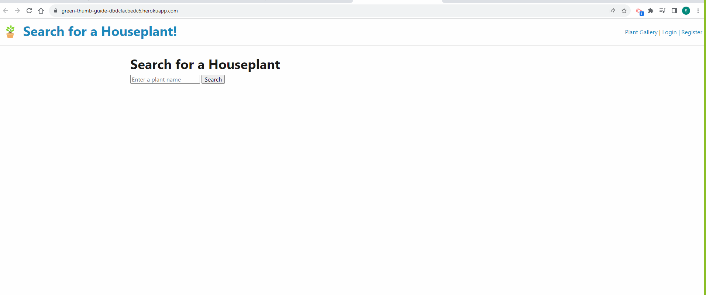

# Green-Thumb-Guide

## Description

AS AN owner of indoor plants I WANT to make sure I am properly caring for all of my plants, and add and track plant data where other users can input data as well.

## Installation

To install code, run the following command:
Git clone <paste SSH key>

## Deployed Link

https://green-thumb-guide-dbdcfacbedc6.herokuapp.com/

## Usage

## Process Steps

1. Created repo and set up file structure
2. Created handlebars, routes files
